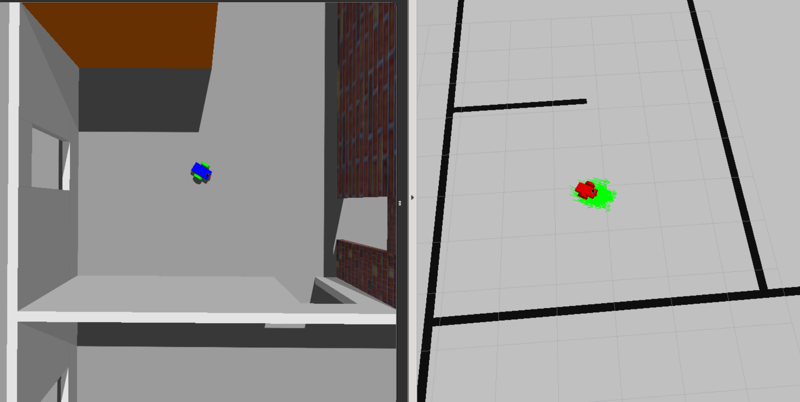

# Where Am I?
In this project, we create a simulated robot using Gazebo and Ros that can identify the pose and localization. We use ROS [AMCL](http://wiki.ros.org/amcl) package. The package is an implementation of the adaptive Monte Carlo localization approach.

## Dependencies
- Ubuntu 16.04
- ROS Kinetic Kame
- [AMCL]((http://wiki.ros.org/amcl)) ROS Module
## Installation
- Create a workspace

        mkdir -p catkin_ws
        cd catkin_ws

- Clone this repository on the src folder location
  
        git clone git@github.com:hurtadosanti/localization.git ./src

- Initialize workspace
        
        cd src
        catkin_init_workspace

- Build
  
        cd ..
        catkin_make
        
## Execution

- Run the main program in a terminal with X support
  
        cd catkin_ws
        source devel/setup.bash
        roslaunch my_robot world.launch

## License
MIT License Copyright (c) 2020 Santiago Hurtado
