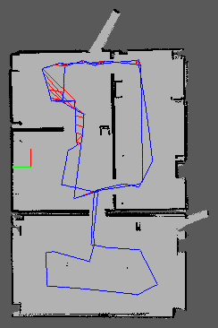

# Map My World!
In this project we created a 2D occupancy grid and 3D octomap from a simulated environment using your own robot with the RTAB-Map package.

## 2D Map

## 3D Map

## Dependencies
- Ubuntu 16.04
- ROS Kinetic Kame
- [AMCL](http://wiki.ros.org/amcl) ROS Module
- [RTABMAP](http://wiki.ros.org/rtabmap_ros)

## Installation
- Create a workspace

        mkdir -p catkin_ws
        cd catkin_ws

- Clone this repository on the src folder location
  
        git clone git@github.com:hurtadosanti/mapping.git ./src

- Initialize workspace
        
        cd src
        catkin_init_workspace

- Build
  
        cd ..
        catkin_make

## Execution

- Run the main program in a terminal with X support
  
        cd catkin_ws
        source devel/setup.bash
        roslaunch my_robot world.launch

- Run the teleop package
        cd catkin_ws
        source devel/setup.bash
        roslaunch my_robot teleop.launch

- Run the mapping package and navigate
        cd catkin_ws
        source devel/setup.bash
        roslaunch my_robot mapping.launch

## Resources
[Rtab Database](./resources/rtabmap.db.tar.xz)

## License
MIT License Copyright (c) 2020 Santiago Hurtado
